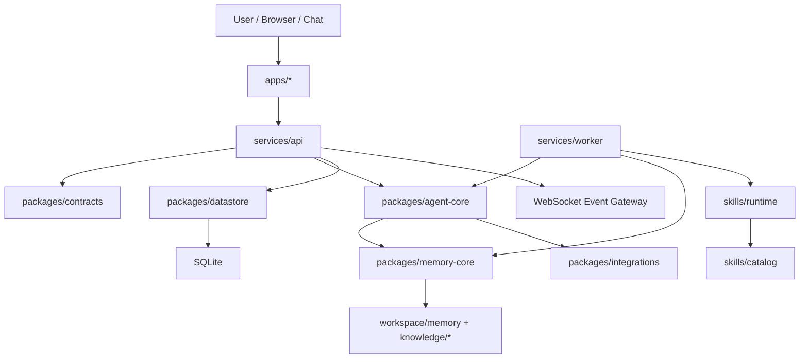

# Niannian Workspace Architecture Redesign

> Scope: multi-agent workspace, dashboard, skills, memory, knowledge base, automation scripts.
> Goal: turn the current mixed workspace into a maintainable platform-style monorepo.

## 1. Current Diagnosis

The repository is valuable, but its boundaries are blurred:

- Runtime state, product documents, agent memories, skills, dashboard code, and one-off scripts live side by side at the repository root.
- `dashboard-v4/server/src/routes.ts` combines routing, SQL, validation, business logic, and event broadcasting in one file.
- Shared TypeScript utilities live in `lib/`, but there is no package boundary, versioning, or import contract.
- Agent identity, task dispatch, memory, evolution, and skill execution are described in many documents, but the executable source is scattered.
- The repository currently contains Windows-invalid file paths in Git history. Windows checkout needs a cleanup commit or sparse/export workflow.

The redesign keeps the spirit of the project: a personal multi-agent operating workspace. The main shift is to make the system explicit: platform core, apps, agents, skills, knowledge, and operations each get a clear home.

## 2. Target Shape

```text
niannian-workspace/
  apps/
    dashboard/               # React UI, API client, realtime views
    ops-console/             # future: local admin tooling
  services/
    api/                     # Fastify API and websocket gateway
    worker/                  # schedulers, heartbeats, ingestion, sync jobs
  packages/
    agent-core/              # task planning, dispatch, capability model
    contracts/               # shared schemas, API types, event contracts
    datastore/               # sqlite migrations, repositories, unit of work
    memory-core/             # memory index, extraction, shared knowledge
    resilience/              # retry, circuit breaker, pipeline recovery
    integrations/            # Feishu, OpenRouter, Discord, browser, external APIs
    ui-kit/                  # shared UI components, design tokens
  agents/
    registry/                # agent manifests and capability profiles
    playbooks/               # role-specific operating guides
  skills/
    catalog/                 # skill manifests and source
    runtime/                 # skill loading, validation, execution wrapper
  knowledge/
    library/                 # curated reusable knowledge
    raw/                     # imported raw material
    reports/                 # generated outputs
  workspace/
    state/                   # STATE.yaml, current goals, kanban
    memory/                  # dated memory and per-agent memory
    inbox/                   # incoming tasks
    outbox/                  # completed handoff payloads
  docs/
    architecture-redesign.md
    workspace-boundaries.md
    adr/                     # architecture decision records
  scripts/
    dev/
    maintenance/
    migration/
```

## 3. Layered Architecture



## 4. Responsibility Split

| Layer | Owns | Must not own |
| --- | --- | --- |
| `apps/*` | UI, routing, page state, API calls | SQL, filesystem parsing, agent scheduling |
| `services/api` | HTTP routes, websocket gateway, auth boundary, request lifecycle | direct business decisions hidden in route files |
| `services/worker` | scheduled jobs, heartbeat collection, ingestion, background sync | browser UI state |
| `packages/contracts` | API schemas, event names, shared TypeScript types | database implementation |
| `packages/datastore` | migrations, repositories, SQLite connection | Fastify route definitions |
| `packages/agent-core` | agent registry, task decomposition, dispatch waves, capability matching | UI rendering |
| `packages/memory-core` | memory extraction, indexing, shared knowledge publishing | task execution side effects |
| `packages/resilience` | retry, timeout, fallback chain, circuit breaker | domain-specific agent logic |
| `packages/integrations` | Feishu, OpenRouter, Discord, external service adapters | cross-agent orchestration policy |
| `skills/catalog` | installable skill sources and manifests | runtime state |
| `workspace/*` | live mutable state and generated memory | library source code |

## 5. Service Redesign

### API Service

Move `dashboard-v4/server` into `services/api`.

Target internal structure:

```text
services/api/src/
  main.ts
  plugins/
    cors.ts
    websocket.ts
    errors.ts
  routes/
    agents.routes.ts
    tasks.routes.ts
    metrics.routes.ts
    events.routes.ts
    config.routes.ts
  modules/
    agents/
      agent.service.ts
      agent.repository.ts
    tasks/
      task.service.ts
      task.repository.ts
    metrics/
      metrics.service.ts
      metrics.repository.ts
  events/
    event-bus.ts
    websocket-publisher.ts
```

Rule: route files only translate HTTP input/output. Services own behavior. Repositories own SQL.

### Worker Service

Create `services/worker` for work that should not live in request handlers:

- Read `workspace/state/STATE.yaml`.
- Watch `workspace/memory/**`.
- Sync agent capability profiles.
- Run scheduled memory compaction.
- Publish events into the same event bus used by the API.
- Trigger skill validation and registry refresh.

### Dashboard App

Move `dashboard-v4/client` into `apps/dashboard`.

Suggested frontend structure:

```text
apps/dashboard/src/
  app/
    router.tsx
    providers.tsx
  features/
    agents/
    tasks/
    metrics/
    events/
  shared/
    api/
    realtime/
    components/
    state/
```

Rule: feature folders own pages, components, hooks, and API adapters for one domain.

## 6. Package Redesign

### `packages/contracts`

This is the first package to create. It prevents frontend/backend drift.

Move and upgrade:

- `lib/api-schema-validator.ts`
- `lib/api-schema-examples/*`
- dashboard API response types
- websocket event names

Target exports:

```ts
export type AgentStatus = 'online' | 'offline' | 'busy' | 'idle' | 'error';
export type TaskStatus = 'todo' | 'in_progress' | 'review' | 'done' | 'cancelled';
export type WsEvent =
  | { type: 'agent.status_changed'; payload: AgentStatusChanged }
  | { type: 'task.created'; payload: TaskCreated }
  | { type: 'task.updated'; payload: TaskUpdated };
```

### `packages/agent-core`

Move and normalize:

- `lib/batch-dispatcher.ts`
- `agents/main/task_splitter.js`
- agent capability matching logic
- task dependency graph validation

This package should expose pure orchestration logic. It should receive a `spawnAgent` adapter, not import any specific runtime directly.

### `packages/datastore`

Extract SQLite from `dashboard-v4/server/src/db.ts`.

Target:

- `migrations/*.sql`
- `connection.ts`
- `repositories/agent.repository.ts`
- `repositories/task.repository.ts`
- `repositories/event.repository.ts`
- `repositories/metric.repository.ts`

This gives tests a stable database boundary and keeps SQL out of Fastify routes.

### `packages/memory-core`

Move:

- `lib/memory-indexer.ts`
- shared knowledge extraction rules
- memory compaction utilities

This package owns transformations between raw memory files, indexed facts, and `SHARED_KNOWLEDGE.md`.

### `packages/resilience`

Move:

- `lib/error-recovery.ts`

Keep it domain-neutral and test it heavily, because it becomes shared infrastructure for API, worker, and integrations.

### `packages/integrations`

Move:

- `lib/feishu-hub.ts`
- active Feishu integration code after dependencies are restored
- external model routing clients

Each integration should expose an interface and an implementation. The API and worker consume interfaces.

## 7. Data Model

Use SQLite for now, but formalize the schema. The current scale does not require Postgres.

Core tables:

- `agents`: static and current agent state.
- `agent_capabilities`: capability dimensions, score, evidence, updated time.
- `tasks`: task graph nodes.
- `task_dependencies`: normalized dependency edges instead of JSON-only dependencies.
- `events`: append-only system events.
- `metrics`: time-series measurements.
- `memory_entries`: indexed memory records.
- `skill_manifests`: registered skills and validation status.

Principle: JSON fields are acceptable for flexible metadata, but graph edges and filterable fields should be normalized.

## 8. Event Contract

Adopt dot-separated event names across API, worker, and dashboard:

```text
agent.status_changed
agent.heartbeat_seen
task.created
task.updated
task.completed
memory.entry_indexed
memory.shared_knowledge_published
skill.registered
skill.validation_failed
system.alert_raised
```

All events share an envelope:

```ts
interface DomainEvent<TPayload> {
  id: string;
  type: string;
  source: string;
  occurredAt: string;
  correlationId?: string;
  payload: TPayload;
}
```

WebSocket should publish these envelopes directly. REST responses should not invent separate event shapes.

## 9. Agent Runtime Model

Agents should be described by manifests rather than scattered docs.

```yaml
id: dev_engineer
displayName: Dev Engineer
role: backend and platform implementation
modelProfile: coder
capabilities:
  - code_generation
  - architecture_refactor
  - debugging
memoryPath: workspace/memory/agents/dev_engineer
playbookPath: agents/playbooks/dev_engineer.md
```

The scheduler should consume these manifests to decide:

- Who can own a task.
- Which skills are available.
- Which memory paths should be loaded.
- Which quality gates apply before completion.

## 10. Migration Plan

### Phase 0: Repository Hygiene

- Remove or rename Windows-invalid Git paths.
- Add `README.md` with the new map.
- Add root `pnpm-workspace.yaml`.
- Add `.gitignore` rules for SQLite WAL files, generated reports, caches, and local runtime state.
- Decide whether `workspace/*` is committed, partially committed, or local-only.

### Phase 1: Contracts First

- Create `packages/contracts`.
- Move shared `Agent`, `Task`, `Metric`, `Event` types into it.
- Make dashboard client and API import the same types.
- Add schema validation tests.

### Phase 2: API Boundary

- Move `dashboard-v4/server` to `services/api`.
- Split `routes.ts` into route modules.
- Extract SQL into repositories.
- Extract business operations into services.
- Keep endpoint behavior unchanged during this phase.

### Phase 3: Dashboard Boundary

- Move `dashboard-v4/client` to `apps/dashboard`.
- Convert current pages into feature folders.
- Replace duplicated frontend types with `packages/contracts`.
- Keep the visual redesign separate from architecture migration.

### Phase 4: Agent Core

- Move `BatchDispatcher` and task splitting into `packages/agent-core`.
- Define `spawnAgent` as an injected adapter.
- Add graph validation for task dependencies.
- Add capability-based assignment as a pure function.

### Phase 5: Memory and Skills

- Move memory logic into `packages/memory-core`.
- Move skill source into `skills/catalog`.
- Add `skills/runtime` for manifest validation and execution wrappers.
- Make worker own indexing, compaction, and skill refresh jobs.

### Phase 6: Operations

- Add CI checks for typecheck, unit tests, schema validation, and Windows path validation.
- Add architecture decision records for major tradeoffs.
- Add a `scripts/migration` folder for one-time moves and data transforms.

## 11. First Implementation Backlog

1. Fix invalid Git paths so the repo can be cloned normally on Windows.
2. Create `packages/contracts` and move shared types out of dashboard and `lib`.
3. Split `dashboard-v4/server/src/routes.ts` into route, service, and repository modules.
4. Extract SQLite migrations from `db.ts`.
5. Convert `lib/batch-dispatcher.ts` into `packages/agent-core`.
6. Add a root workspace file and package scripts.
7. Add `docs/adr/0001-monorepo-boundaries.md`.

## 12. Non-Goals

- Do not migrate from SQLite to Postgres yet.
- Do not redesign the dashboard UI in the same step as the backend split.
- Do not rewrite all skills at once.
- Do not delete historical memory. Move it behind clearer boundaries first.
- Do not make every document executable. Keep docs as docs, but link them to owning modules.

## 13. Success Criteria

The redesign is successful when:

- A new contributor can identify where UI, API, agent orchestration, memory, and skills belong in under five minutes.
- API routes contain minimal business logic.
- Frontend and backend share one contract package.
- Agent scheduling can be tested without starting Fastify or the dashboard.
- Memory indexing can run as a worker job without touching UI code.
- Windows, macOS, and Linux can all clone the repository without special checkout workarounds.
