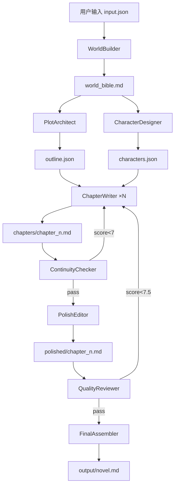

## 1. 系统概览

<callout emoji="🎯" background-color="light-blue">
用户输入一句话灵感 → 系统全自动产出 5-10 万字完整小说，目标耗时 ≤30 分钟
</callout>

### 1.1 核心理念
- **流水线模式**：创作拆解为多个阶段，每个阶段由专业 Agent 负责
- **质量门控**：每个阶段有明确通过标准，不达标自动回退
- **并行加速**：无依赖章节并行生成，有依赖阶段严格串行
- **数据驱动**：所有 Agent 通过文件系统交换数据

### 1.2 关键指标

| 指标 | 目标值 |
|------|--------|
| 总耗时 | ≤ 30 分钟（5万字） |
| 单章字数 | 3000-8000 字 |
| 角色一致性评分 | ≥ 8/10 |
| 剧情连贯性评分 | ≥ 7/10 |
| 全流程自动通过率 | ≥ 80% |

---

## 2. Agent 角色定义

| Agent ID | 名称 | 职责 | 模型建议 | 调用次数 |
|----------|------|------|----------|----------|
| world_builder | 世界观建筑师 | 构建世界观、背景设定 | GPT-4.1 / Claude Sonnet | 1 次 |
| plot_architect | 剧情架构师 | 全书大纲、章节摘要 | GPT-4.1 / Claude Sonnet | 1 次 |
| character_designer | 角色设计师 | 角色档案、关系图谱 | Claude Sonnet | 1 次 |
| chapter_writer | 章节撰写师 | 逐章撰写正文 | Claude Sonnet / GPT-4.1 | N 次（可并行） |
| continuity_checker | 连贯性检查员 | 逻辑、伏笔、角色一致性 | Claude Haiku / GPT-4o-mini | N 次 |
| polish_editor | 润色编辑 | 文笔润色、风格统一 | Claude Sonnet | N 次 |
| quality_reviewer | 质量审查官 | 终审评分、问题标记 | GPT-4.1 / Claude Opus | 1 次 |
| final_assembler | 终稿整合师 | 合并章节、生成目录 | 轻量模型 | 1 次 |

### WorldBuilder — 世界观建筑师
<callout emoji="🧠" background-color="light-purple">
将一句话灵感扩展为完整世界观：时代背景、地理环境、核心冲突、规则体系、氛围基调
</callout>

- **输入**：`input.json`（用户原始输入）
- **输出**：`world_bible.md`（1500-3000 字）
- **关键要求**：设定有独特性、每个设定点有内在逻辑

### PlotArchitect — 剧情架构师
<callout emoji="📐" background-color="light-purple">
基于世界观设计全书剧情大纲，拆解为章节结构，输出 JSON 格式
</callout>

- **输入**：`world_bible.md`
- **输出**：`outline.json`（含 title、synopsis、chapters 数组、arc_structure 三幕结构）

### CharacterDesigner — 角色设计师
<callout emoji="🎭" background-color="light-purple">
创建核心角色档案：外貌、性格、背景故事、动机、成长弧线、关系图谱
</callout>

- **输入**：`world_bible.md`、`outline.json`
- **输出**：`characters.json`（主要角色 3-5 人 + 配角 5-8 人）

### ChapterWriter — 章节撰写师
<callout emoji="✍️" background-color="light-purple">
基于世界观+大纲+角色档案撰写单章正文，严格遵守大纲 key_events
</callout>

- **输入**：世界观 + 大纲 + 角色 + 当前章节计划 + 前序章节摘要
- **输出**：`chapters/chapter_{n}.md`
- **要求**：开头有吸引力、场景有画面感、对白角色化、节奏张弛有度、结尾留悬念

### ContinuityChecker — 连贯性检查员
<callout emoji="🔍" background-color="light-purple">
检查角色行为一致性、设定一致性、时间线、伏笔追踪、细节矛盾
</callout>

- **通过标准**：评分 ≥ 7/10

### PolishEditor — 润色编辑
<callout emoji="✨" background-color="light-purple">
文笔润色：提升画面感、优化对话自然度、增强情感渲染、消除语病、统一风格
</callout>

### QualityReviewer — 质量审查官
<callout emoji="🏆" background-color="light-purple">
全书终审：7 个维度评分（剧情完整性、角色深度、文笔、节奏、主题、创新性、可读性）
</callout>

- **通过标准**：综合评分 ≥ 7.5 且无单项低于 6

### FinalAssembler — 终稿整合师
<callout emoji="📦" background-color="light-purple">
合并所有章节，生成目录、封面文案，输出最终小说文件
</callout>

---

## 3. 数据流图



### 数据依赖矩阵

| Agent | 依赖上游 | 输出文件 | 可并行 |
|-------|----------|----------|--------|
| WorldBuilder | input.json | world_bible.md | ❌ |
| PlotArchitect | world_bible.md | outline.json | ❌ |
| CharacterDesigner | world_bible.md + outline.json | characters.json | ⚠️ 可与大纲尾部并行 |
| ChapterWriter | outline + characters + world_bible | chapters/chapter_{n}.md | ✅ 同一幕内可并行 |
| ContinuityChecker | chapter + characters + continuity_log | reviews/chapter_{n}_continuity.json | ✅ |
| PolishEditor | chapter + style_guide | polished/chapter_{n}.md | ✅ |
| QualityReviewer | polished/* + outline + characters | quality_report.json | ❌ |
| FinalAssembler | polished/* + outline + quality_report | output/* | ❌ |

---

## 4. 编排引擎设计

### 4.1 状态机
```
PENDING → RUNNING → COMPLETED → 下一阶段
PENDING → RUNNING → FAILED → RETRY → RUNNING
PENDING → RUNNING → FAILED → ESCALATE → HUMAN_REVIEW
```

### 4.2 三幕并行策略

<callout emoji="⚡" background-color="light-yellow">
最大并行度：3 个 ChapterWriter 同时工作。同幕内非相邻章节可并行撰写。
</callout>

- **幕一**（第1-3章）：建立世界观、引入角色
- **幕二**（第4-7章）：冲突升级、转折
- **幕三**（第8-10章）：高潮、结局

**连续依赖规则**：第 N+1 章必须在第 N 章连贯性检查通过后才能开始

### 4.3 编排流程
```
Phase 1: 世界观构建（串行）→ gate_check
Phase 2+3: 大纲 + 角色（半并行）→ gate_check
Phase 4: 章节撰写（按幕并行）→ 每章 continuity_check → 不通过则重写
Phase 5: 润色（全并行）
Phase 6: 质检（串行）→ 不达标则指定章节重写
Phase 7: 整合输出
```

---

## 5. 风格统一控制

### 5.1 风格圣经（Style Bible）
由 WorldBuilder 或新增的 StyleDirector Agent 在世界观阶段产出，所有写手 Agent 的 system prompt 都注入这份圣经：

```yaml
# 风格圣经示例
叙事视角: 第三人称有限视角（跟随主角）
时态: 过去式
句式偏好: 短句为主，长句用于描写特殊场景
语气基调: 冷冽克制，偶尔温情
禁忌词汇: 避免现代网络用语
描写风格: 偏视觉和触觉，少心理独白
段落节奏: 每段不超过150字，对话密集用短段
```

### 5.2 角色语音卡（Character Voice Card）
每个角色独立的说话风格定义：

```yaml
主角:
  句式: 简短有力，少用"的"字结尾
  口癖: 特定口头禅
  禁忌: 不说不符合人设的话
  情绪外露方式: 冷笑、沉默、转移话题

配角:
  句式: 长句居多，文绉绉
  口癖: 敬语或特殊称呼
  说话节奏: 先铺垫再点题
```

### 5.3 滚动上下文（Rolling Context）
每个写手写第 N 章时，必须读取：
- 风格圣经 ✅
- 第 N-1 章全文 ✅（模仿上一章的语感）
- 角色语音卡 ✅

### 5.4 润色编辑的风格统一职责
PolishEditor 做全书 pass 时需完成：
- 统一高频词汇（避免同一角色有多种称呼）
- 统一段落节奏感
- 统一描写密度
- 检查角色语气一致性

---

## 6. 角色一致性控制

### 6.1 角色状态档案（Character State Profile）
不是静态人设，而是**动态文档**，每章写完后由 ContinuityChecker 更新：

```yaml
# 角色A - 第N章结束时的状态
身份: 当前身份描述
已知秘密:
  - 知道X ✅
  - 不知道Y ❌
性格锚点:
  - 遇事反应模式
  - 对亲近人的特殊表现
当前关系:
  - 角色B: 关系状态描述
  - 角色C: 关系状态描述
正在做的事: 当前行动线
情绪基调: 当前情绪状态
```

### 6.2 角色知识边界表（Knowledge Boundary Matrix）
防止「角色不应该知道的事却表现得知道」：

| 信息点 | 角色A | 角色B | 角色C | 角色D |
|--------|-------|-------|-------|-------|
| 秘密1 | ✅ | ❌ | ❌ | ❌ |
| 秘密2 | ✅ | ✅ | ✅ | ❌ |
| 秘密3 | ❌ | ✅ | ✅ | ❌ |

**写手写第 N 章前，必须查表确认：这个角色在这个时间点知道什么、不知道什么。**

### 6.3 伏笔台账（动态版）
不只记录伏笔，还记录每个伏笔在每章的状态：

```yaml
伏笔01-名称:
  埋设: 第N章
  暗示点:
    - 第N章: 具体暗示方式
    - 第M章: 进一步暗示
  揭示进度: X%
  预计揭示: 第Y章
  ⚠️ 注意: 揭示前角色不能表现出已知
```

### 6.4 关键冲突节点锁（Locked Moments）
有些角色互动的**关键时刻**必须一致，不能被不同写手写矛盾：

```yaml
锁定事件:
  - 第X章末尾: 关键事件描述
    → 性格体现: 体现了什么特质
    → 后果: 导致了什么变化
  - 第Y章: 另一关键事件
    → 性格体现: 体现了什么特质
    → 关系转变: 关系如何变化

⚠️ 任何写手都不能改写或忽略这些锁定事件
```

### 6.5 写手执行流程（含角色控制）

```
写手拿到第N章任务
    ↓
读取：风格圣经 + 第N-1章 + 角色语音卡
    ↓
读取：角色状态档案（第N-1章结束时的状态）
    ↓
读取：知识边界表（谁能知道什么）
    ↓
读取：伏笔台账（哪些伏笔需要暗示/推进）
    ↓
读取：关键冲突节点锁（本章有哪些必须写的事件）
    ↓
写作 → 交稿
    ↓
连贯性检查员验证：
  - 角色行为是否符合性格锚点？
  - 角色有没有说不该知道的话？
  - 伏笔推进是否合理？
  - 关系变化是否自然？
  ↓
✅ 通过 → 更新角色状态档案
❌ 不通过 → 打回重写具体段落
```

### 6.6 角色一致性检测清单

| 检查项 | 标准 |
|--------|------|
| 语气一致 | 角色说的话符合语音卡 |
| 知识一致 | 没有越界知识泄露 |
| 行为一致 | 符合性格锚点，无OOC |
| 情绪弧线 | 情绪变化有前因后果 |
| 关系状态 | 与上一章的关系状态连贯 |
| 外貌描写 | 发型/服装/伤疤等细节一致 |
| 称呼一致 | 角色间怎么称呼彼此没乱 |

### 6.7 三层防线总结

```
第一层（写前）: 角色档案 + 知识边界 + 节点锁
第二层（写中）: 滚动上下文（上一章全文）+ 语音卡
第三层（写后）: 连贯性检查员 + 状态档案更新
```

**核心理念：角色不是静态人设，是状态机。每章结束更新状态，下章开始读取状态。**

---

## 7. 文件结构

```
novel_project_{timestamp}/
├── input.json                    # 用户原始输入
├── config.json                   # 项目配置
├── world_bible.md                # 世界观设定
├── outline.json                  # 全书大纲
├── characters.json               # 角色档案
├── continuity_log.json           # 连贯性日志
├── style_guide.json              # 风格指南
├── chapters/                     # 原始章节
├── reviews/                      # 审查报告
├── polished/                     # 润色后章节
├── output/                       # 最终输出
│   ├── novel.md                  # 完整小说
│   ├── novel.json                # 结构化数据
│   ├── toc.md                    # 目录
│   └── quality_report.json       # 质量报告
└── logs/                         # 运行日志
```

---

## 8. 质量门控

| 阶段 | 门控条件 | 不通过处理 |
|------|----------|-----------|
| 世界观 | AI 自评 ≥ 8 分 | 回退重做（最多 2 次） |
| 大纲 | 章节数达标、三幕结构完整 | 回退重做 |
| 角色 | 主角 ≥ 3 人、关系图完整 | 回退重做 |
| 单章撰写 | 连贯性评分 ≥ 7 | 反馈后重写（最多 3 次） |
| 润色 | 改动比例 ≤ 30% | 标记人工审核 |
| 全书质检 | 综合评分 ≥ 7.5、无单项 < 6 | 指定章节重写 |

---

## 9. 错误处理与回退

<callout emoji="🛡️" background-color="light-red">
**三层回退策略**：自动重写 → 降级通过 → 人工介入
</callout>

| 错误类型 | 处理策略 |
|----------|---------|
| Agent 超时（>5 分钟） | 重试 1 次，仍失败则降级模型重试 |
| 章节连贯性不达标 | 反馈给 ChapterWriter 重写（最多 3 轮） |
| 全书质检不达标 | 仅重写低分章节（score<6），不全书重来 |
| 角色一致性严重问题 | ContinuityChecker 生成修正指令，ChapterWriter 按指令改写 |
| API 限流 | 指数退避重试（30s → 60s → 120s） |

---

## 10. 配置与扩展

### config.json 示例
```json
{
  "genre": "科幻",
  "style": "赛博朋克",
  "target_chapters": 10,
  "words_per_chapter": 5000,
  "total_words_target": 50000,
  "tone": ["紧张", "悬疑", "冷峻"],
  "language": "zh-CN",
  "max_retries": 3,
  "parallel_chapters": 3,
  "quality_threshold": 7.5
}
```

### 扩展点
- **题材扩展**：修改 genre/style 即可适配不同题材
- **字数调整**：修改 target_chapters 和 words_per_chapter
- **模型切换**：每个 Agent 可独立配置模型
- **多语言**：修改 language 字段 + 对应语言 Prompt

---

## 11. 实施建议

### 11.1 技术选型

| 组件 | 推荐方案 |
|------|---------|
| 编排引擎 | Python asyncio / Node.js |
| Agent 调用 | OpenClaw sessions_spawn |
| 文件存储 | 本地文件系统 / S3 |
| 状态管理 | JSON 文件 + 文件锁 |
| 模型 API | OpenRouter（多模型统一入口） |

### 11.2 推荐模型配置（通义/智谱/Kimi）

<callout emoji="💡" background-color="light-yellow">
可用模型：通义（Qwen）、智谱（GLM）、Kimi（Moonshot）
</callout>

| Agent | 推荐模型 | 备选模型 | 原因 |
|-------|---------|---------|------|
| ChiefNarrator | Qwen3.5-Plus | Kimi-K2.5 | 深度思考 + 长上下文理解 |
| WorldBuilder | Qwen3.5-Plus | Kimi-K2.5 | 创意+推理平衡 |
| PlotArchitect | Qwen3.5-Plus | Kimi-K2.5 | 结构化输出稳定 |
| CharacterDesigner | Kimi-K2.5 | Qwen3.5-Plus | 角色塑造 + 长文本理解 |
| ChapterWriter | Kimi-K2.5 | Qwen3.5-Plus | 长文本生成（Kimi 擅长长文） |
| ContinuityChecker | GLM-4.5-Air | Qwen3.5-Plus | 快速检查，省成本 |
| PolishEditor | Kimi-K2.5 | Qwen3.5-Plus | 文笔润色 + 长上下文 |
| QualityReviewer | Qwen3.5-Plus | GLM-4.6 | 严格评分 + 逻辑推理 |
| FinalAssembler | GLM-4.5-Air | - | 简单拼接，最省成本 |

**模型路由规则：**
- 需要深度推理（ChiefNarrator/PlotArchitect/QualityReviewer）→ Qwen3.5-Plus
- 需要长文本生成（ChapterWriter/PolishEditor/CharacterDesigner）→ Kimi-K2.5
- 需要快速/低成本（ContinuityChecker/FinalAssembler）→ GLM-4.5-Air

### 11.3 成本估算（5 万字小说，Kimi API 定价）

| Agent | 预估 Token | 模型 | 预估成本 |
|-------|-----------|------|---------|
| ChiefNarrator | ~10K | Qwen3.5-Plus | ¥0.04 |
| WorldBuilder | ~5K | Qwen3.5-Plus | ¥0.02 |
| PlotArchitect | ~10K | Qwen3.5-Plus | ¥0.04 |
| CharacterDesigner | ~8K | Kimi-K2.5 | ¥0.06 |
| ChapterWriter ×10 | ~200K | Kimi-K2.5 | ¥1.50 |
| ContinuityChecker ×10 | ~60K | GLM-4.5-Air | ¥0.03 |
| PolishEditor ×10 | ~150K | Kimi-K2.5 | ¥1.13 |
| QualityReviewer | ~30K | Qwen3.5-Plus | ¥0.12 |
| FinalAssembler | ~2K | GLM-4.5-Air | ¥0.001 |
| **总计** | **~473K** | 混合 | **~¥2.94** |

<callout emoji="💰" background-color="light-green">
一部 5 万字小说的 AI 生成成本约 ¥3，耗时约 25-35 分钟。比 GPT/Claude 方案便宜 10 倍！
</callout>
